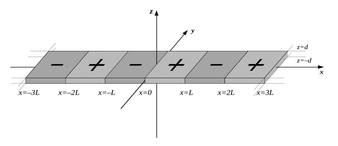
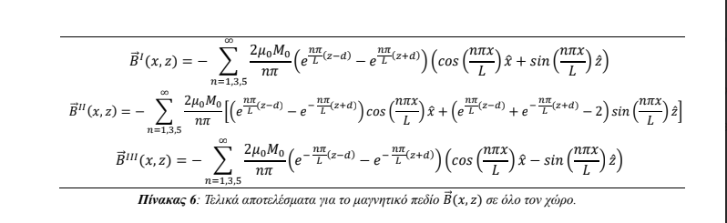
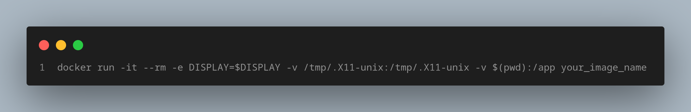

 

### 🛠 Python
### 🛠 Docker

 

# SrFe12O19 Magnetic Field B(x,z)

This project plots the magnetic field B(x,z) produced in the space above, below and inside a ferromagnetic rectangular sample (Strodium Hexaferrite) of alternating Magnetization. It works as complementary visualization of my Bachelor thesis 'Μagnetization orientation of a ferromagnet of rectangular cross-section by displacement of its magnetic walls by a constant external magnetic field´. The program utlilizes the formulas developed in the paper to visualize the ferromagnet's magnetic field.

## Theory

The ferromagnet is of rectangular shape, with dimensions 70 x 10 x 1 (mm) (Fig. 1). It is consisted of magnetic domains of alternating magnetization along its length. More simply said, it is like combining multiple magnets of up, down, up, etc polarity one next to the other, in a one rigid body.

   
  Fig. 1: Schematic illustration of the experimental setup, which consists of magnetic domains of width L, of alternating magnetization of constant homogeneous intensity.

 

The formulas developed in the thesis, that describe the Magnetic field B(x,z) are the following:

   
  Fig. 2: Final results for the magnetic field B(x,z) for every sub-space.

 

where the indices I, II, III are used to describe the sub-space, below, inside and above the ferromagnet, respectively. It is necessary to mention that the theoretical analysis conducted in the paper, that resulted into the development of the aforementioned formulas considers an ideal sample of infinite y-dimension. What this means, said more simply, is that the visualization is accurate for regions in the respective subspaces that are "far" from any of the sample's borders.

## Environment

The project is developed in a slim python based docker container, which includes all the necessary dependencies and tools to run and execute. It is noted that a container being a command-line environment by default (headless environment), cannot natively support an interactive 3D graph because it lacks a graphical display server. However, this functionality is enabled by using X11 forwarding, which allows a container to use the host machine's display to render its graphical output. X11 forwarding creates a secure tunnel between the container and the host's X server, allowing the containerized application to draw its windows on the host's screen.

The container runs using the following command

## Run

The program defines a few useful contants, relative to the experimental process conducted during the thesis production, in the .env file. When run, the Qt environmental framework is fully interactive, where it is possilble to traverse through the grid, rotate, and zoom in and out, using the corresponding buttons in the menu on the top.
